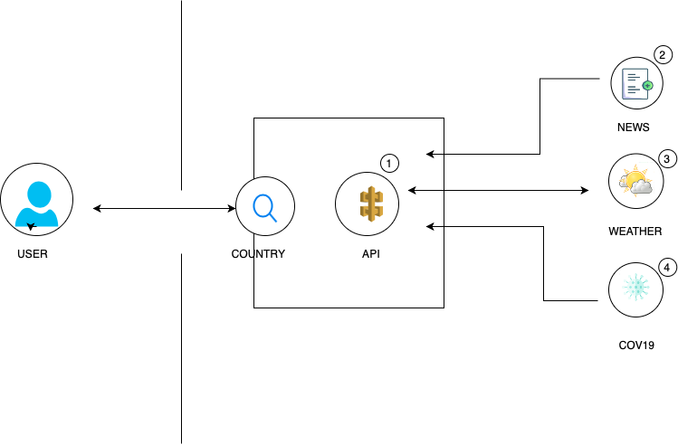
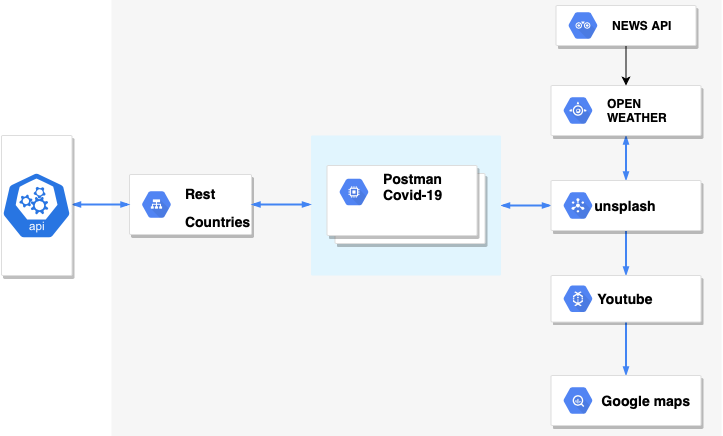

# Project_1
- [Web Travelers Github IO](https://yoloko.github.io/Travel-Advisory/)

- [Web Travelers Demo Video](https://drive.google.com/file/d/1xz1efj-yd15f9efBGLsDXVAb-77Mz9A_/view)

---

## Team Members/ Task

* HASAN - API, HTML AND CSS
* KAMAL- CSS, HTML AND API
* JV- API, CSS AND HTML
* FAITH- README, POWERPOINT AND HTML

## Motivation

Due to the current pandemic it is imperative that you are aware of the situation every country is facing before travel. the motivation of this application was driven by covid19.

## Description Of Application / How To Use The Application

Due to the current pandemic  it is imperative that you are  aware of the situation every country is facing before travel.This applaction was build to help users  search different country all over the world with a focus on weather, news, maps, pandemic and so many more. the motivation behind this app was driven by covid19.

## Features Of The Application

. Hover tool 
. Videos
. Images
. Maps
. News 
. Weather

## Design Process

## Technology Used
* HTML 
* CSS 
* Javascript 
* Bootstrap 
* Rest Countries API 
* Covid API 
* Weather API 
* Unsplash API  
* Youtube API  
* Google Maps API 

## Future Development 

Ask the  user a couple of important questions 

[ "WHAT DO YOU LOVE", " DO YOU HAVE ALLERGIES" , "WHAT DO YOU LIKE TO EAT"];

Help the user figure out if it is safe to travel to a certain country 

